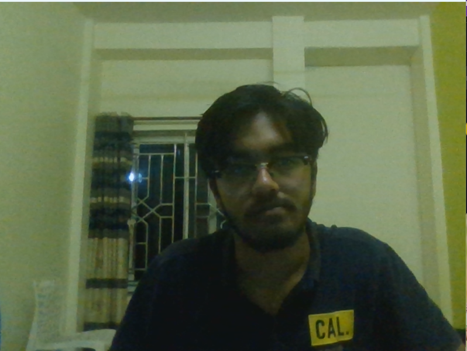
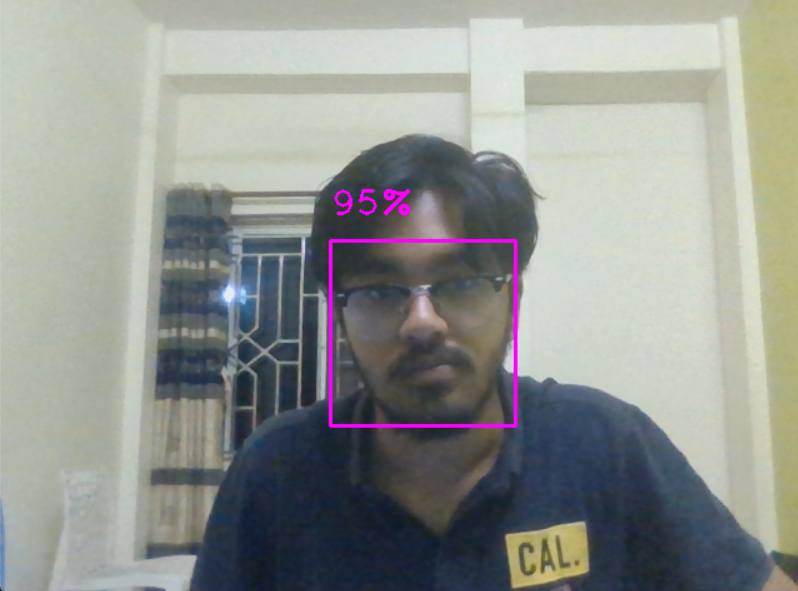
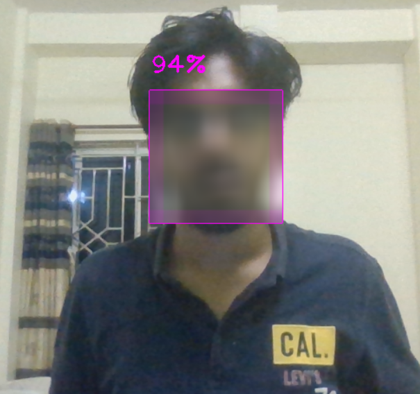
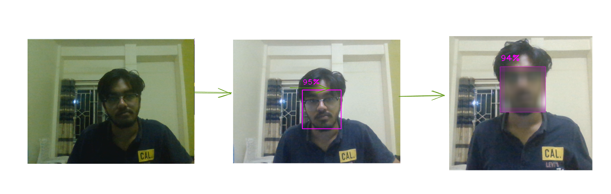

**Blurring the face with OpenCV**


> Opencv

Inspired By: 
1. https://www.youtube.com/watch?v=cxs6iXeyfEY
2. https://www.geeksforgeeks.org/python-opencv-cv2-blur-method/

*Working Prototype*
1. Opening the video camera
```
# import the opencv library
import cv2

# define a video capture object
vid = cv2.VideoCapture(0)
vid.set(3,640)
vid.set(3,480)

while(True):
	ret, frame = vid.read()
	cv2.imshow('frame', frame)
	if cv2.waitKey(1) & 0xFF == ord('q'):
		break

# After the loop release the cap object
vid.release()
# Destroy all the windows
cv2.destroyAllWindows()
```


>>The code triggers the webcam to work on. In the above code, we create a loop that continuously reads frames from the camera using the capture.read() function. Inside the loop, you can perform various operations on each frame, such as image processing, object detection, or any other computer vision task. The frames are displayed in a window named 'Camera' using `cv2.imshow()`. To exit the loop and close the program, you can press the 'q' key, which is checked using `cv2.waitKey(1) == ord('q')`. Finally, make sure to release the camera capture using capture.release() and close any open windows using `cv2.destroyAllWindows().`

2. Bounding the face of the video
`from cvzone.FaceDetectionModule import FaceDetector` has been used over for the bounding box of the face 

>> Only the face with `p>0.75` is bounded on
```
# import the opencv library
import cv2
from cvzone.FaceDetectionModule import FaceDetector

# define a video capture object
vid = cv2.VideoCapture(0)
vid.set(3,640)
vid.set(3,480)
detector =FaceDetector(minDetectionCon=0.75)

while(True):
	ret, frame = vid.read()
	frame,bboxs=detector.findFaces(frame,draw= True)
	if bboxs:
        
		for i ,bbox in enumerate(bboxs):
			x,y,w,h = bbox['bbox']
			imgCrop = frame[y:y+h,x:x+w]
						# ksize
			ksize = (30, 30)
			

	# Display the resulting frame
	cv2.imshow('frame', frame)
	
	
	# the 'q' button is set as the
	# quitting button you may use any
	# desired button of your choice
	if cv2.waitKey(1) & 0xFF == ord('q'):
		break

# After the loop release the cap object
vid.release()
# Destroy all the windows
cv2.destroyAllWindows()

```
3. Blurring the selected region

Code:
```
# import the opencv library
import cv2
from cvzone.FaceDetectionModule import FaceDetector

# define a video capture object
vid = cv2.VideoCapture(0)
vid.set(3,640)
vid.set(3,480)
detector =FaceDetector(minDetectionCon=0.75)

while(True):
	
	# Capture the video frame
	# by frame
	ret, frame = vid.read()
	frame,bboxs=detector.findFaces(frame,draw= True)
	if bboxs:
        
		for i ,bbox in enumerate(bboxs):
			x,y,w,h = bbox['bbox']
			imgCrop = frame[y:y+h,x:x+w]
						# ksize
			ksize = (30, 30)
			
			# Using cv2.blur() method 
			imgCrop= cv2.blur(imgCrop, ksize, cv2.BORDER_DEFAULT) 
			frame[y:y+h,x:x+w] = imgCrop
			# cv2.imshow(f'Img cropped{i}',imgCrop)

	# Display the resulting frame
	cv2.imshow('frame', frame)
	
	
	# the 'q' button is set as the
	# quitting button you may use any
	# desired button of your choice
	if cv2.waitKey(1) & 0xFF == ord('q'):
		break

# After the loop release the cap object
vid.release()
# Destroy all the windows
cv2.destroyAllWindows()
```


**Model**

